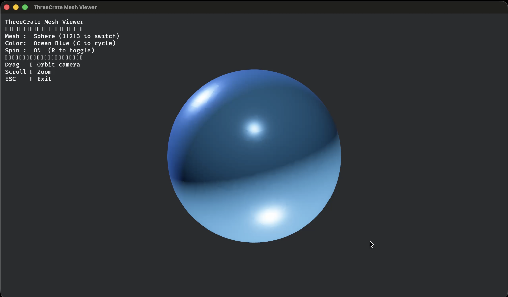

# threecrate

A high-performance 3D point cloud and mesh processing library for Rust, with Python bindings.


[](https://crates.io/crates/threecrate)
[](https://pypi.org/project/threecrate/)
[](https://docs.rs/threecrate)
[](https://github.com/rajgandhi1/threecrate/actions)
[](https://github.com/rajgandhi1/threecrate)
[](CONTRIBUTING.md)

## What's inside

| Crate | What it does |
|---|---|
| `threecrate-core` | Point, PointCloud, TriangleMesh, Transform3D |
| `threecrate-algorithms` | Filtering, ICP, NDT, global registration, segmentation, normals, FPFH/SHOT, mesh boolean, smoothing |
| `threecrate-gpu` | GPU filtering, segmentation, ICP, normals, nearest-neighbor, TSDF, real-time rendering (wgpu) |
| `threecrate-io` | PLY, OBJ, PCD, XYZ/CSV, LAS/LAZ\*, E57\* — streaming and memory-mapped |
| `threecrate-reconstruction` | Poisson, BPA, alpha shapes, Delaunay, Marching Cubes, MLS, auto-select |
| `threecrate-simplification` | Quadric error, edge collapse, clustering, progressive mesh |
| `threecrate-visualization` | Interactive viewer — orbit/pan/zoom, GPU-accelerated |

\* opt-in feature flags

## Viewer



## Quick start

**Rust**

```toml
[dependencies]
threecrate = "0.8.0"
```

```rust
use threecrate::prelude::*;

let cloud = read_point_cloud("scan.ply")?;
let cloud = voxel_grid_filter(&cloud, 0.05)?;
let normals = estimate_normals(&cloud, 10)?;
let mesh = auto_reconstruct(&normals)?;
write_mesh("output.obj", &mesh)?;
```

**Python**

```bash
pip install threecrate
```

```python
import threecrate as tc

cloud = tc.read_point_cloud("scan.ply")
cloud = tc.voxel_downsample(cloud, voxel_size=0.05)
normal_cloud = tc.estimate_normals(cloud)
mesh = tc.poisson_reconstruct(normal_cloud)
tc.write_mesh(mesh, "output.ply")
```

## Comparison

| Feature | threecrate | Open3D | PCL |
|---|---|---|---|
| Language | Rust + Python | Python (C++ core) | C++ |
| `pip install` | ✅ | ✅ | ❌ |
| Memory safety | ✅ Rust | ❌ | ❌ |
| GPU compute | ✅ wgpu | ✅ CUDA | Partial |
| Global registration | ✅ FPFH+RANSAC | ✅ | ✅ |
| Surface reconstruction | ✅ 6 algorithms | ✅ | ✅ |
| Streaming I/O | ✅ PLY/OBJ/XYZ | ❌ | ❌ |
| E57 support | ✅ opt-in | ❌ | ❌ |
| WebAssembly | Roadmap | ❌ | ❌ |

## Benchmarks

We benchmarked ThreeCrate against **Open3D 0.19** on the same machine, using
full-resolution frames from three real datasets: TUM RGB-D, KITTI, and
nuScenes-mini. Everything runs on CPU. In the table below, higher is better — a
ratio above 1 means ThreeCrate is faster than Open3D.

| Workload | How ThreeCrate compares |
|---|---:|
| Reading files (raw float parsing) | **1.8x–2.2x faster** |
| Voxel downsampling | **1.6x–1.8x faster** |
| Normal estimation | 0.57x–1.09x (falls behind on big clouds) |
| Single-scale ICP | 0.71x–0.99x (falls behind on big clouds) |

The short version: ThreeCrate is noticeably quicker at loading data and
downsampling, and it trades blows with Open3D on the heavier compute work. On
small and medium clouds it holds its own; on large clouds it still gives up some
ground on normal estimation and dense ICP. We're being upfront about that — those
are the two areas we're actively working on.

One thing we won't pretend about: **we haven't benchmarked PCL yet.** The harness
to do it is written and ready in [`scripts/pcl_bench/`](scripts/pcl_bench), but
until we've actually run it, there are no PCL numbers here to quote.

Want the full picture? [docs/benchmarks.md](docs/benchmarks.md) has every number
(full-resolution and capped), how we measured, the caveats we ran into, and the
exact command to reproduce it yourself.

## Docs

- [Installation & feature flags](docs/installation.md)
- [Crate reference](docs/crates.md)
- [Examples](docs/examples.md)
- [Python API reference](threecrate-python/README.md)
- [API docs on docs.rs](https://docs.rs/threecrate)

## Contributing

Contributions are welcome — algorithms, Python bindings, new formats, docs.

- [ROADMAP.md](ROADMAP.md) — where we're ahead, where we trail, and what's next
- [CONTRIBUTING.md](CONTRIBUTING.md) — setup and guidelines
- [Open issues](https://github.com/rajgandhi1/threecrate/issues) — look for `good first issue`
- [GitHub Discussions](https://github.com/rajgandhi1/threecrate/discussions) — questions and ideas

## License

licensed under MIT
