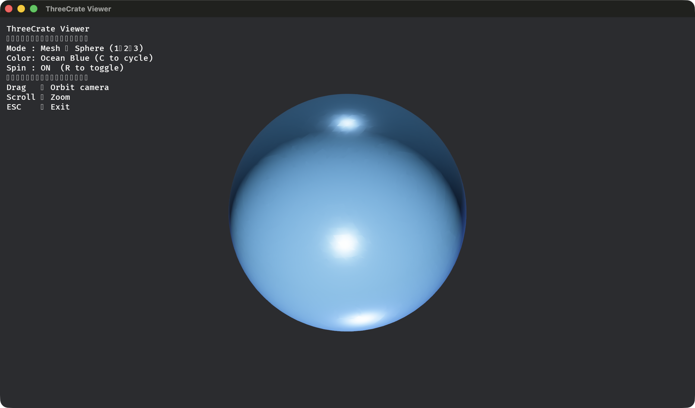
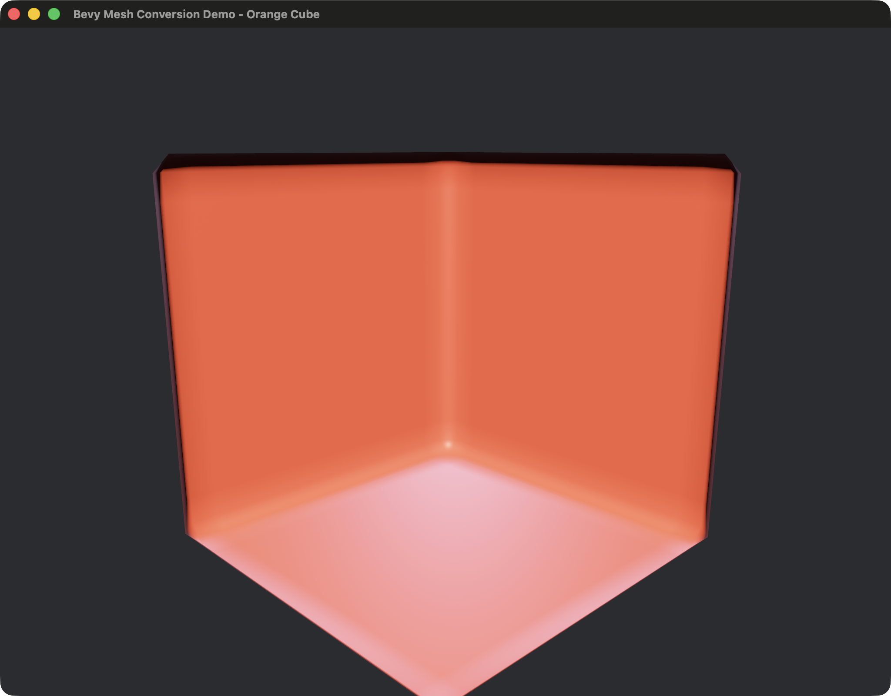
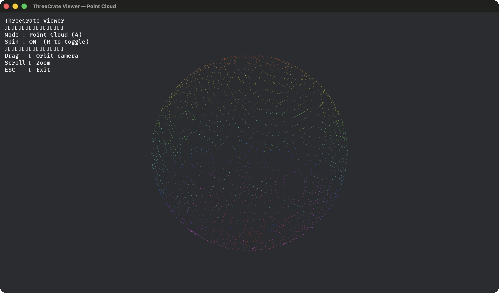
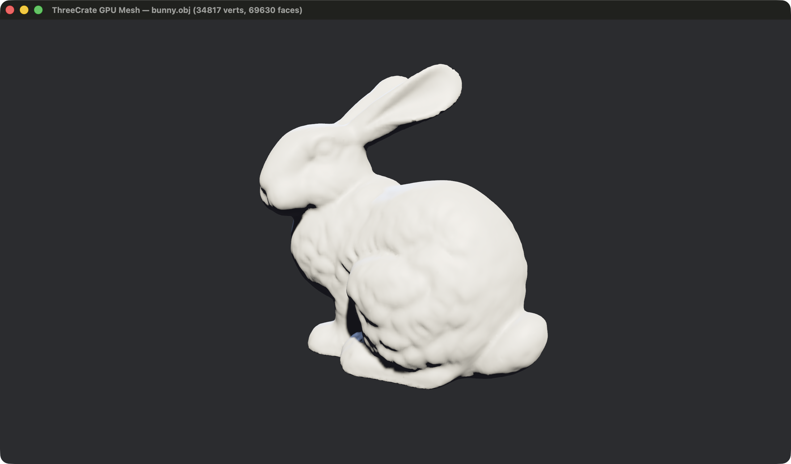

# Examples

Runnable examples live in the [`examples/`](../examples/) directory. Run any with:

```bash
cargo run -p threecrate-examples --bin basic_usage
cargo run -p threecrate-examples --bin ransac_plane_example
# ...
```

---

## Bevy mesh viewer (full-featured)

```bash
cargo run -p threecrate-examples --bin bevy_mesh_viewer --features bevy_interop
```



PBR-lit viewer built on Bevy. Press `1`/`2`/`3` to switch between Sphere, Torus, and Gyroid meshes (all generated live via Marching Cubes). Press `C` to cycle material colours, `R` to toggle auto-rotate. Drag to orbit, scroll to zoom.

---

## Bevy conversion demo

```bash
cargo run -p threecrate-examples --bin bevy_conversion_demo --features bevy_interop
```



Converts a `threecrate_core::TriangleMesh` to a `bevy::Mesh` at runtime, prints the attribute details, then launches the Bevy viewer so you can inspect the result interactively.

---

## Interactive viewer (winit)

```bash
cargo run -p threecrate-examples --bin interactive_viewer_example
```



Lightweight orbit/pan/zoom viewer using `threecrate_visualization::InteractiveViewer` — no Bevy dependency required.

---

## GPU mesh rendering

```bash
cargo run -p threecrate-examples --bin gpu_mesh_render_example
```



wgpu-based real-time mesh renderer.

---

## ICP registration (`basic_usage`)

```bash
cargo run -p threecrate-examples --bin basic_usage
```

```
ThreeCrate Basic Usage Example
=============================

1. Basic ICP Registration
-------------------------
  Source points : 1000
  Target points : 1000
  ICP converged in 23 iterations
  Final RMSE    : 0.001247

2. ICP with Known Transformation
--------------------------------
  Applied rotation: 45° around Z, translation (1, 0, 0)
  ICP converged in 18 iterations
  Rotation error   : 0.0003 rad
  Translation error: 0.0008 m

3. ICP with Noise
-----------------
  Noise σ=0.01 — converged in 31 iterations, RMSE: 0.0089
```

---

## RANSAC plane segmentation (`ransac_plane_example`)

```bash
cargo run -p threecrate-examples --bin ransac_plane_example
```

```
=== RANSAC Plane Segmentation Example ===

1. Simple planar point cloud:
   Input points: 10000
   Found inliers: 9743
   Plane coefficients: [0.0000, 0.0000, 1.0000, 0.0000]
   Inlier percentage: 97.4%

2. Noisy planar point cloud:
   Input points: 10000
   Found inliers: 7821
   Inlier percentage: 78.2%
```

---

## Euclidean clustering (`euclidean_cluster_example`)

```bash
cargo run -p threecrate-examples --bin euclidean_cluster_example
```

```
=== Euclidean Cluster Extraction Example ===

1. Three well-separated blobs:
   Input points : 3000
   Clusters found: 3
   Cluster 1: 1000 points
   Cluster 2: 1000 points
   Cluster 3: 1000 points

2. Parallel extraction on a denser scene:
   Input points : 50000
   Clusters found: 5
```

---

## Mesh smoothing (`mesh_smoothing_example`)

```bash
cargo run -p threecrate-examples --bin mesh_smoothing_example
```

```
=== Mesh Smoothing Example ===

Input mesh: 25 vertices, 32 faces
Spike vertex z before smoothing: 2.0000

1. Laplacian (λ=0.5, 10 iters):
   Spike vertex z: 0.3821
   Spread: 0.0412

2. Taubin (λ=0.5, μ=-0.53, 10 iters):
   Spike vertex z: 0.1204
   Spread: 0.0387

3. HC smoothing (α=0.5, β=0.5, 10 iters):
   Spike vertex z: 0.0973
   Spread: 0.0401
```

---

## Normal estimation (`normal_estimation_example`)

```bash
cargo run -p threecrate-examples --bin normal_estimation_example
```

```
Enhanced Normal Estimation Example
===================================
✓ Created sample point cloud with 5000 points

1. Basic k-NN Normal Estimation
--------------------------------
✓ Estimated normals using k-NN in 12.3ms
  - Result: 5000 points with normals

2. Radius-based Normal Estimation
-----------------------------------
✓ Estimated normals using radius search in 18.7ms
  - Result: 5000 points with normals
```

---

## K-nearest neighbors (`k_nearest_neighbors_example`)

```bash
cargo run -p threecrate-examples --bin k_nearest_neighbors_example
```

```
=== K-Nearest Neighbors Example ===

Created point cloud with 1000 points
Added 20 random points. Total: 1020 points

1. Finding k-nearest neighbors for each point:
   Found 5 nearest neighbors for each point:
   Point 0: [1, 4, 7, 2, 9]
   Point 1: [0, 4, 2, 7, 3]
   ... and 1018 more points
```

---

## SIMD distances (`simd_distance_example`)

```bash
cargo run -p threecrate-examples --bin simd_distance_example
```

```
=== SIMD Distance Computation Example ===

--- Batch distance computation (16 points) ---
Max SIMD vs scalar error: 0.00e0  (should be ~0)
First 4 squared distances: [1.23, 4.56, 0.89, 2.34]

--- k-NN search comparison ---
SIMD  k=3 nearest: [2, 5, 8]
Scalar k=3 nearest: [2, 5, 8]
Results match: true
```

---

## Mesh boolean operations (`mesh_boolean_example`)

```bash
cargo run -p threecrate-examples --bin mesh_boolean_example
```

```
=== Mesh Boolean Operations Example ===

Cube A: 8 verts, 12 faces
Cube B: 8 verts, 12 faces
(The two cubes overlap in the region [1,2]^3)

1. Union (A ∪ B):
   20 verts, 36 faces

2. Intersection (A ∩ B):
   8 verts, 12 faces

3. Difference (A − B):
   14 verts, 24 faces
```

---

## Marching cubes (`test_marching_cubes`)

```bash
cargo run -p threecrate-examples --bin test_marching_cubes
```

```
Testing Complete Marching Cubes Implementation
==============================================

Test 1: Extracting isosurface from a sphere...
  ✓ Successfully extracted mesh from sphere
  - Vertices: 1284
  - Faces: 2564
  - Has normals: true

Test 2: Extracting isosurface from a torus...
  ✓ Successfully extracted mesh from torus
  - Vertices: 3812
  - Faces: 7620
```

---

## Streaming pipeline (`streaming_pipeline`)

```bash
cargo run -p threecrate-examples --bin streaming_pipeline
```

```
=== Streaming Point Cloud Pipeline Example ===

Synthetic dataset: 500000 points
In-memory size: ~6.0 MB

--- Pass 1: Streaming statistics (chunk_size=10 000) ---
  Points processed : 500000
  Bounding box     : (-5.00,-5.00,-5.00) – (5.00,5.00,5.00)
  Mean position    : (0.00,0.01,-0.01)
  Chunks processed : 50  (43.21 ms total)
  Throughput       : 11.6 Mpts/s

--- Pass 2: Streaming voxel filter (voxel_size=0.05) ---
  Output points    : 38412
  Reduction ratio  : 92.3%
  Elapsed          : 81.4 ms
```

---

## GPU compute (`gpu_example`, `gpu_filtering_example`)

```bash
cargo run -p threecrate-examples --bin gpu_example
cargo run -p threecrate-examples --bin gpu_filtering_example
```

These examples run GPU-accelerated compute passes (voxel filtering, nearest-neighbor) and print timing results to the terminal. No window is opened.

---

## Python

```python
import numpy as np
import threecrate as tc

cloud = tc.read_point_cloud("scan.ply")
cloud = tc.voxel_downsample(cloud, voxel_size=0.02)
cloud = tc.remove_statistical_outliers(cloud)

# Segment dominant plane
result = tc.segment_plane(cloud, threshold=0.01)
plane_cloud = result.inlier_cloud(cloud)

# Cluster remaining points
clusters = tc.extract_clusters(cloud)
print(f"{len(clusters)} objects found")

# Reconstruct surface
normal_cloud = tc.estimate_normals(cloud)
mesh = tc.poisson_reconstruct(normal_cloud)
mesh = tc.smooth_mesh_taubin(mesh, iterations=10)
mesh = tc.simplify_mesh(mesh, reduction_ratio=0.5)
tc.write_mesh(mesh, "output.ply")
```

For the full Python API see [`threecrate-python/README.md`](../threecrate-python/README.md).
